# Evaluación 2 - Iplacex - Integración de Sistemas

_Se realiza 2 proyectos en Springboot Java que interactuan con cola ActiveMQ(Consumer/Producer), mediante Apache Camel._

_Adicionalmente desde el Producer se consume end-point Rest donde se rescatan los pedidos a enviar a MQ, también se consume una BD en Mongo desde donde se rescatan el resto de parametros._

_El ActiveMQ esta configurado en modo de persistencia conectado a una BD Postgres._

## Comenzando 🚀

_Estas instrucciones te permitirán obtener una copia del proyecto en funcionamiento en tu máquina local para propósitos de desarrollo y pruebas._

### Pre-requisitos 📋

```
- npm/Node para levantar json-server
- JDK 1.8 para levantar el proyecto principal en Java
- docker/docker-compose para levantar las BDs Mongo, Postgres, el ActiveMQ
```

### Instalación 🔧

_A continuación instalación de Json-Server_

_Paso 1: Luego de instalado Node ejecutar comando:_

```
npm install -g json-server
```

_Paso 2: Navegar hasta donde se encuentra \*.json, que se convertiran en Api Rest:_

```
cd Data
```

_Paso 3: Levantar servicios, verificar que se encuentra libre el puerto 3000-3001-3002-3003 (ejecutar un comando por terminal, ya que la solución debe quedar corriendo)_

```
json-server --watch db-rest-pedidos.json --port 3000 -d 100
json-server --watch db-rest-empresaA.json --port 3001 -d 100
json-server --watch db-rest-empresaB.json --port 3002 -d 100
json-server --watch db-rest-empresaC.json --port 3003 -d 100
```

_Paso 4: Configurar persistencia MQ, según IP_LOCAL (usar la ip de su maquina):_

```
cd docker-activemq-mongodb/activemq-volume/conf
nano db.properties
```

```
amq.db.host=IP_LOCAL
```

_Paso 5: Configurar proyecto java Consumer, según IP_LOCAL (usar la ip de su maquina):_

```
cd camel-consumer-a/src/main/resources
nano application.properties
```

```
spring.activemq.broker-url=tcp://IP_LOCAL:61616
```

_Paso 6: Configurar proyecto java Producer, según IP_LOCAL (usar la ip de su maquina):_

```
cd camel-producer-a/src/main/resources
nano application.properties
```

```
spring.activemq.broker-url=tcp://IP_LOCAL:61616
spring.data.mongodb.host=IP_LOCAL
```

_Paso 7: Levantar base datos mongo/postgres, activeMQ. Verificar que se encuentra libre los puertos 27017-61616-8161-5432-5050_

```
cd docker-activemq-mongodb/
docker-compose up -d
```

_Una vez realizado lo anterior se puede ejecutar los proyectos java desde Eclipse(preferentemente)_

## Ejecutando las pruebas ⚙️

### Api Rest donde se encuentran los pedidos de la aplicación ⌨️

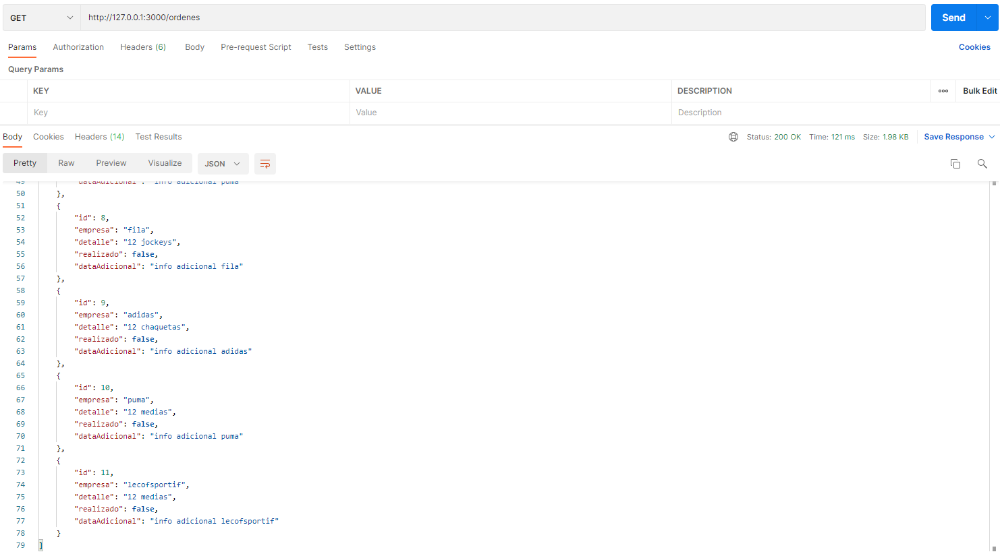

### Api Rest de las empresas ⌨️


### Datos de archivo de entrada con pedidos para la aplicación ⌨️

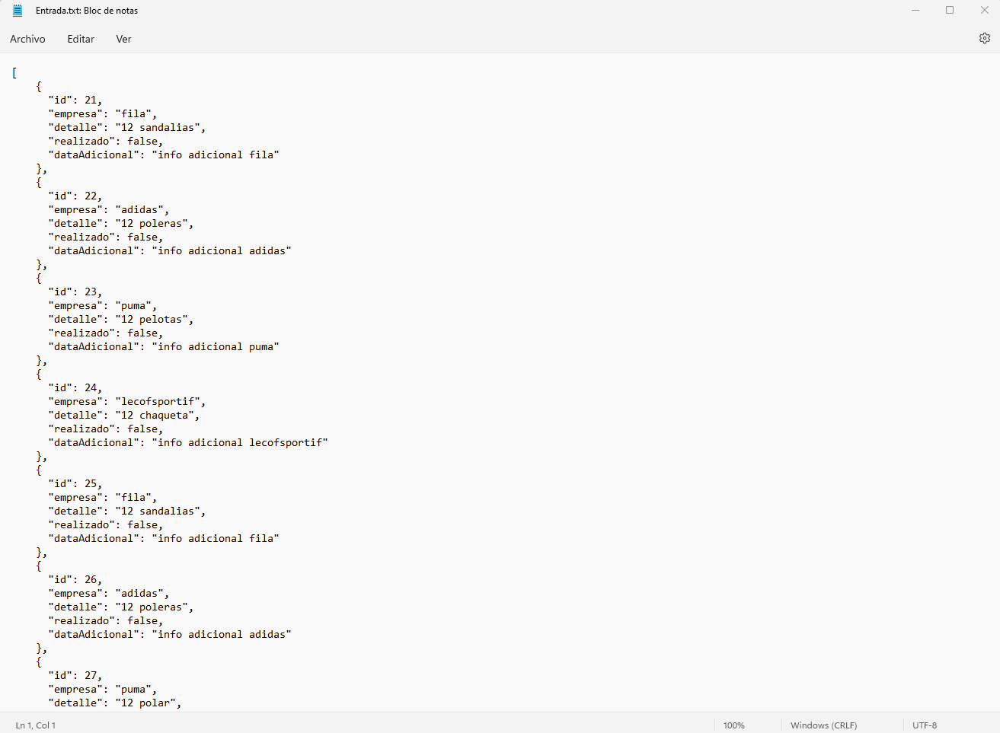

### Revisión de Mongo los parametros adicionales para completar mensajes ⌨️

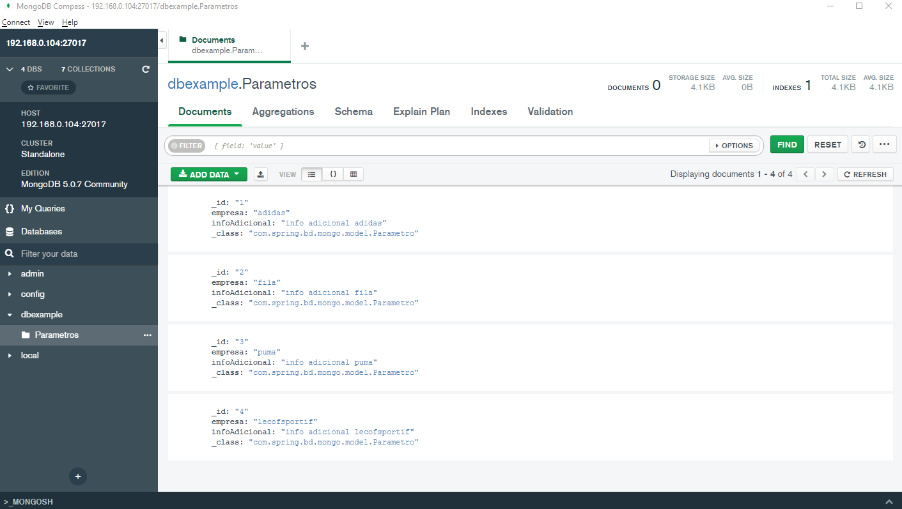

### Ejecución de proyecto Java - Producer 🔩

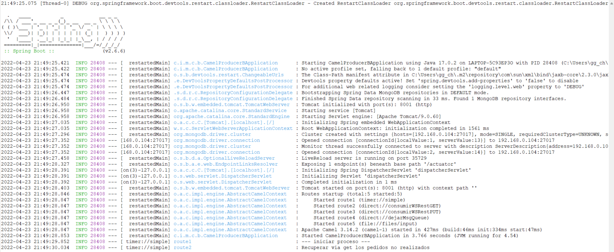

### Vista log cuando consume Rest Pedidos - Producer 🔩

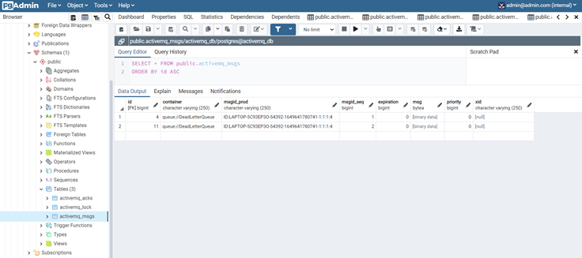

### Revisión de Postgres los mensaje de ActiveMQ fueron insertados ⌨️

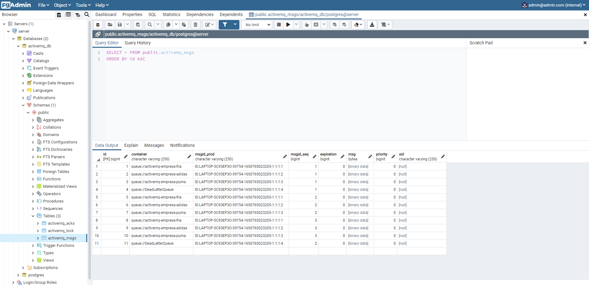

### Revisión de ActiMQ con los colas generadas ⌨️

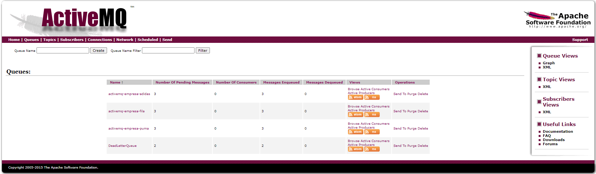

### Revisión de ActiMQ detalle de mensaje ⌨️

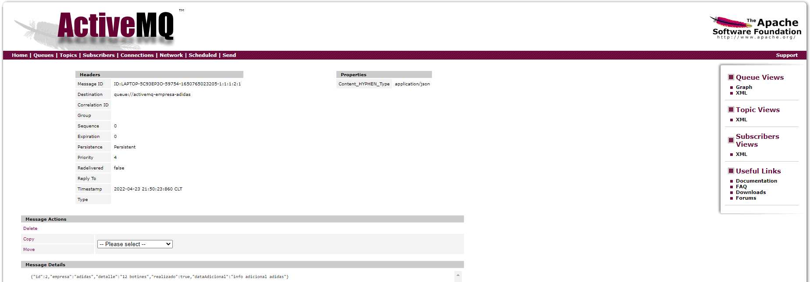

### Api Rest donde se encuentran los pedidos de la aplicación, se observa cambio de estado ⌨️


### Carpeta donde se va a dejar el archivo plano con pedidos ⌨️

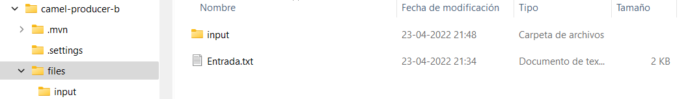

### Vista log cuando consume Archivo Plano - Producer 🔩

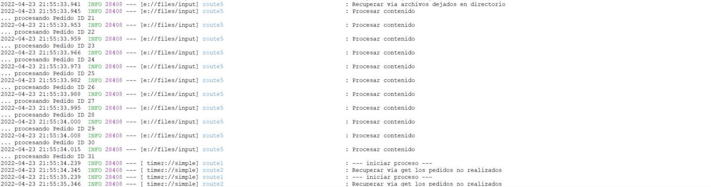

### Revisión de Postgres los mensaje de ActiveMQ fueron insertados ⌨️

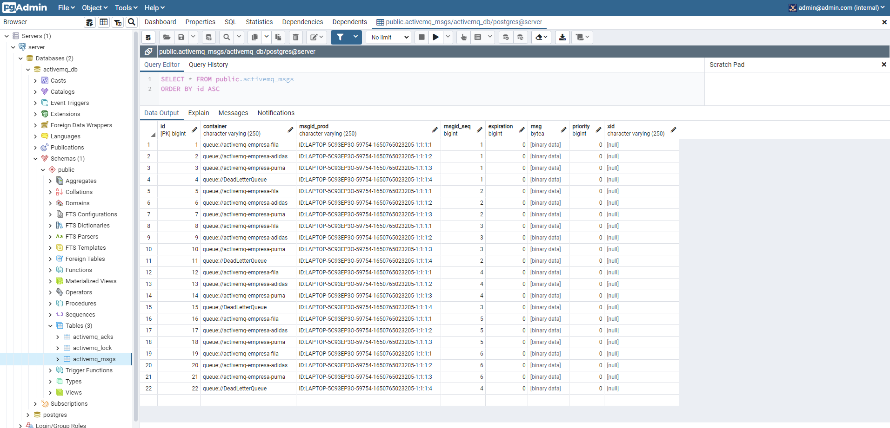

### Revisión de ActiMQ con los colas generadas ⌨️

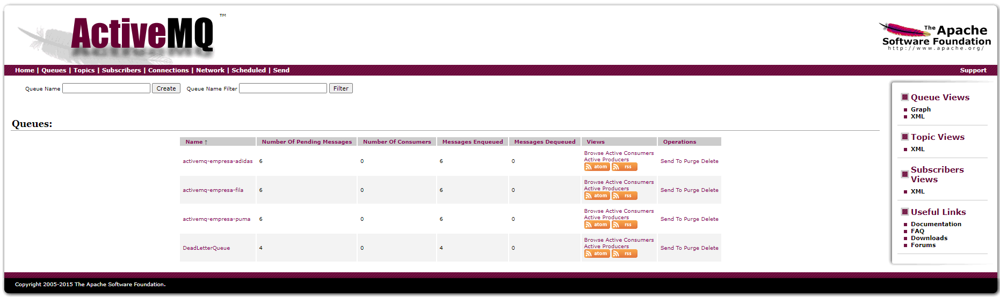

### Archivo plano se mueve de carpeta ⌨️

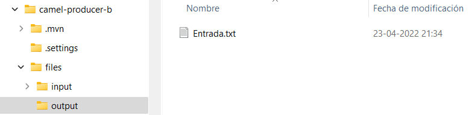

### Ejecución de proyecto Java - Consumer 🔩

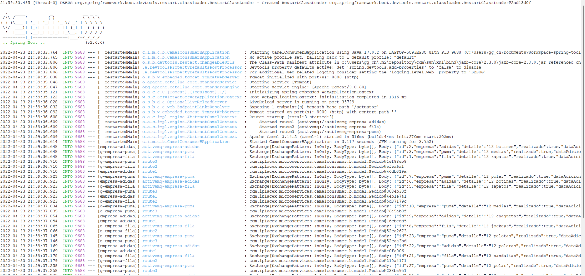

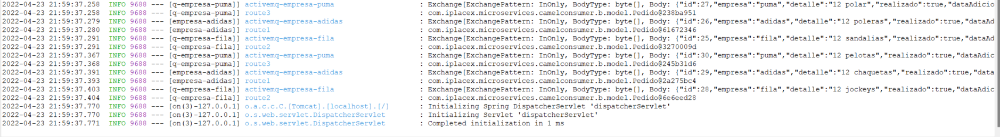

### Revisión de Postgres los mensajes de ActiveMQ se eliminan ⌨️

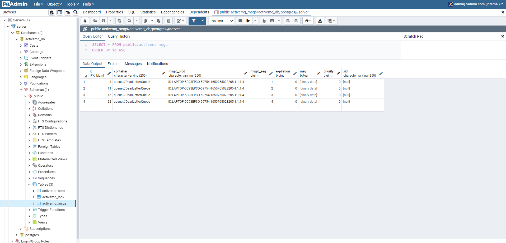

### Revisión de ActiMQ los mensaje fueron consumidos ⌨️

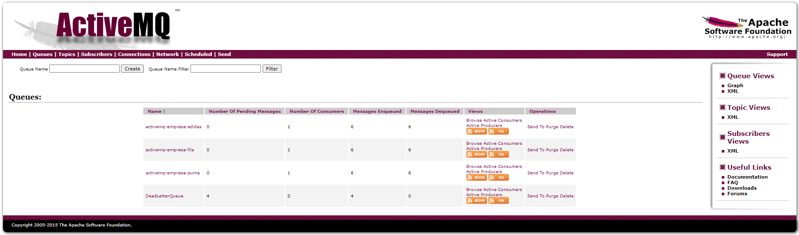

### Api Rest de Empresa A, donde se visualiza los mensaje ingresados ⌨️


### Api Rest de Empresa B, donde se visualiza los mensaje ingresados ⌨️


### Api Rest de Empresa C, donde se visualiza los mensaje ingresados ⌨️

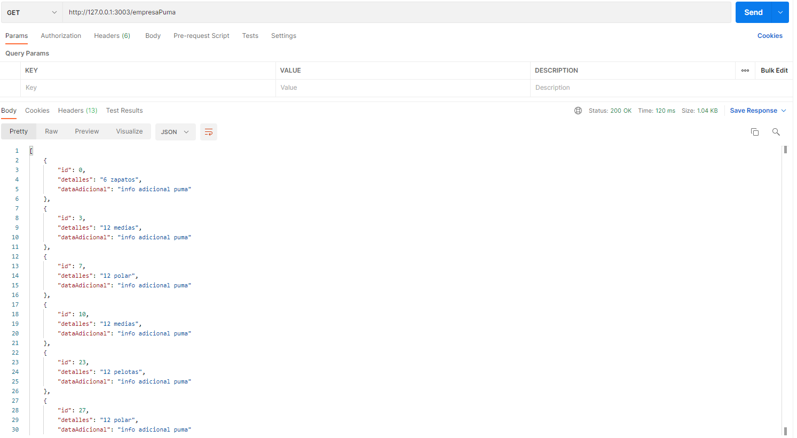

## Construido con 🛠️

_las siguientes herramientas_

- JDK 8
- Springboot 2.6.6
- Apache Camel 3.14.2
- ActiveMQ 5.15.9
- MongoDB (Docker lastest)
- PostgreSQL (Docker lastest)
- Docker/Docker-compose
- [json-server](https://github.com/typicode/json-server) - Get a full fake REST API with zero coding in less than 30 seconds (seriously)

## Autor ✒️

- **Gustavo Chavez** - _Todas las tareas_ - [ggchavez-hotmail](https://github.com/ggchavez-hotmail/iplacex_ingenieria_informatica/tree/main/2_patrones_de_dise%C3%B1o/examen_final)
